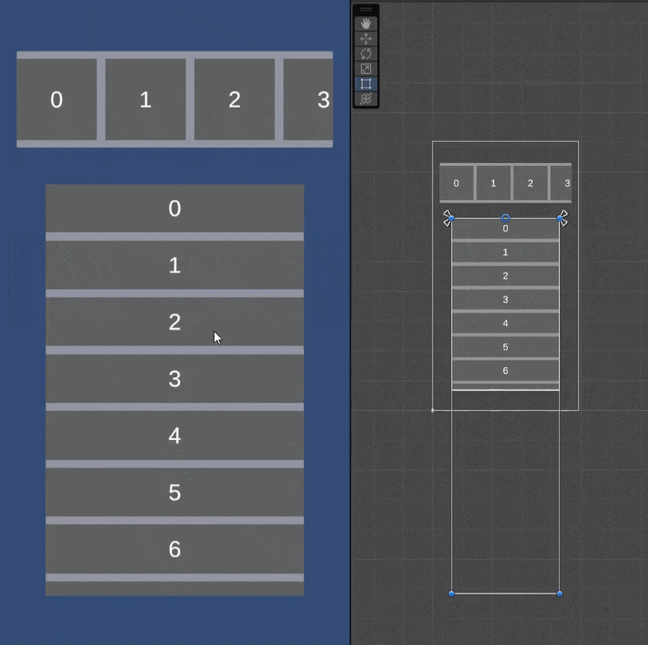
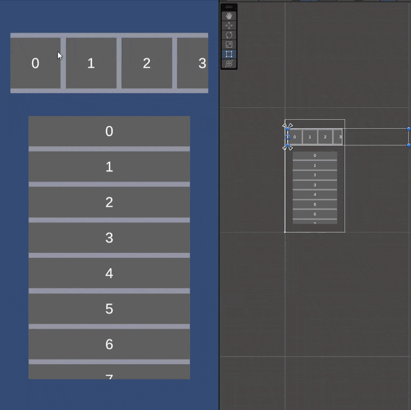

# Recyclable Scroll - Tái sử dụng phần tử

Hệ thống scroll giúp tối ưu hóa hiệu năng bằng cách tái sử dụng các phần tử UI (GameObject). Thay vì khởi tạo hàng ngàn vật phẩm gây tốn bộ nhớ RAM và làm giảm tốc độ xử lý CPU, hệ thống này chỉ duy trì một số lượng nhỏ các phần tử đủ để hiển thị trên màn hình và cập nhật dữ liệu của chúng khi được cuộn.

#### Tính năng chính

- Hiệu năng cao: Chỉ khởi tạo số lượng Object tối thiểu cần thiết để lấp đầy vùng nhìn (Viewport).
- Hỗ trợ dữ liệu lớn: Có thể hiển thị danh sách lên đến hàng nghìn mà không làm tăng mức tiêu thụ tài nguyên.
- Dễ dàng tích hợp: Dựa trên ScrolllRect tiêu chuẩn của Unity UI, có thể tùy chỉnh source code theo ý muốn cá nhân.

#### So sánh với truyền thống

| **Tiêu chí** | **Scroll truyền thống** | **Scroll tái sử dụng** |
| --- | --- | --- |
| **Số lượng Object** | Bằng tổng số lượng data → data càng nhiều - object càng nhiều. | Cố định, thường gấp 2 lần số lượng có thể thấy trong vùng nhìn (viewport). |
| **Tiêu tốn bộ nhớ RAM** | Tăng dần theo dữ liệu | Thấp và ổn định |

#### Nguyên lý hoạt động

- Phân trang: Sử dụng biến `pageIndex` để kiểm soát giới hạn dữ liệu.
- Dịch chuyển: Khi *Content* đến vùng biên của *Viewport*, nó sẽ được đưa về vị trí thích hợp để có thể cuộn được tiếp (đồng thời cập nhật dữ liệu hiển thị).

#### Hướng dẫn cài đặt nhanh

1. Gắn script `RecyclableScrollVertical.cs`/`RecyclableScrollHorizontal.cs` vào *GameObject* có chứa *ScrollRect* (đặt nơi khác cũng được 😅).

2. Kéo các biến `ScrollRect` và `ContentRT` cho `RecyclableScrollVertical.cs`/`RecyclableScrollHorizontal.cs` trên cửa sổ Inspector. Khai báo số lượng hiển thị danh sách tối đa vào `TotalItems` (hoặc set bằng code). Các biến khác hiện trên Inspector sẽ tự động cập nhật chạy.

3. Cấu hình các UI item trong danh sách làm object con của game object *Content* (nên để số lượng vừa đủ kín vùng nhìn - Viewport).

4. Cấu hình `RecyclableScrollVertical.cs`/`RecyclableScrollHorizontal.cs` bằng hàm `Init()` với tham số là hàm callback cập nhật dữ liệu. Xem script mẫu `ItemLoader.cs` và scene mẫu *Scene_RecyclableScroll* trong *Samples*.

5. Get danh sách các UI item trong *Content* bằng hàm `TryGetComponentsInContentChildren()` . Xem script mẫu `ItemLoader.cs` và scene mẫu *Scene_RecyclableScroll* trong *Samples*.